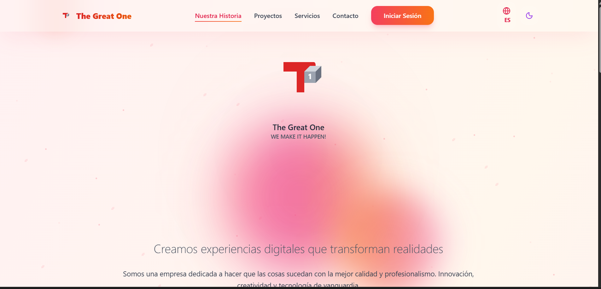
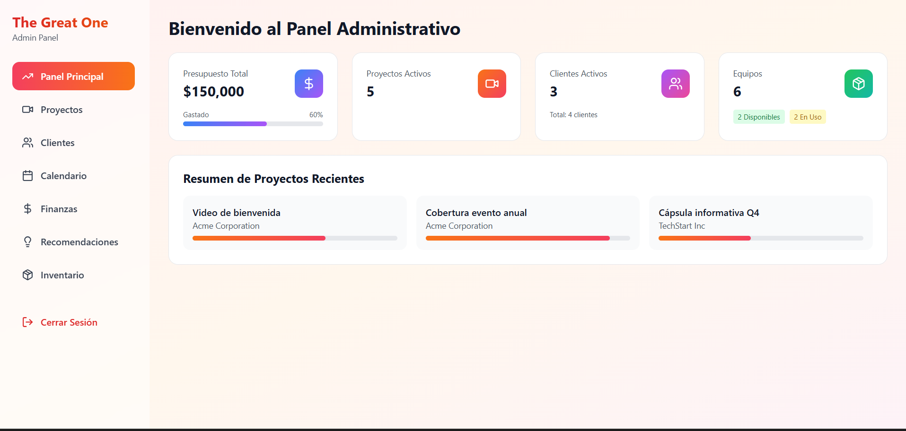
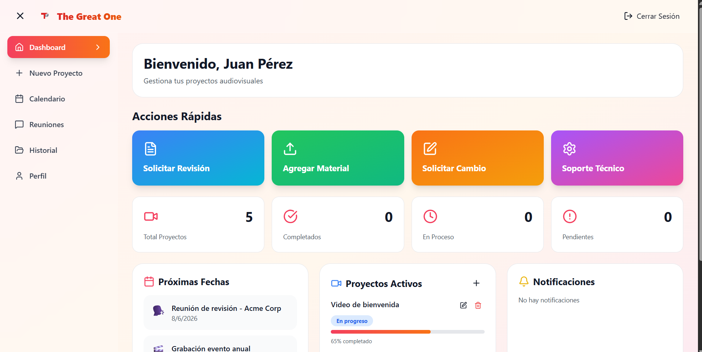

# 🎬 Sistema de Control de Citas — TGO Films
**Appointment Management System — TGO Films**

> Plataforma web para la gestión de citas y clientes de una empresa audiovisual, con interfaz dinámica e integración completa de backend y base de datos.
>
> Web platform for managing appointments and clients for an audiovisual company, featuring a dynamic interface with full backend and database integration.

🔗 **Live demo:** [https://tgofilms1.onrender.com/](https://demo-tg-lxoe.onrender.com/)

---

## 🎥 Demo

<!-- Reemplaza TU_VIDEO_ID con el ID de tu video de YouTube (los caracteres después de ?v=) -->
[Ver demo del sistema](
https://drive.google.com/file/d/1s96eYpqCP6lcJwf0vzFpXu-Ad4_QrLNI/view?usp=drive_link
)

---

## 📸 Screenshots

<!-- Sube tus imágenes a una carpeta llamada "assets" dentro del repo y reemplaza los nombres -->




---

## 📋 Descripción / Description

**ES:** Sistema de gestión de citas desarrollado para una empresa del sector audiovisual. Permite administrar clientes, agendar y dar seguimiento a citas, y gestionar la información operativa del negocio desde una interfaz web moderna.

**EN:** Appointment management system developed for an audiovisual company. It allows managing clients, scheduling and tracking appointments, and handling business operational information through a modern web interface.

---

## ✨ Funcionalidades / Features

- Gestión de clientes / Client management
- Agendamiento y seguimiento de citas / Appointment scheduling and tracking
- Panel administrativo / Admin dashboard
- Interfaz dinámica con React / Dynamic React interface
- API REST para comunicación frontend-backend / REST API for frontend-backend communication

---

## 🛠️ Stack tecnológico / Tech Stack

| Capa / Layer | Tecnología / Technology |
|---|---|
| Frontend | React + Vite |
| Backend | Python |
| Base de datos / Database | PostgreSQL |
| API | REST |
| Control de versiones / Version control | Git & GitHub |

---

## 🚀 Instalación local / Local Setup

```bash
# Clonar el repositorio / Clone the repository
git clone https://github.com/SaintXini/Proyect_Seminario2025>
cd Proyect_Seminario

# Backend
pip install -r requirements.txt
python manage.py migrate
python manage.py runserver

# Frontend
cd frontend
npm install
npm run dev
```

---

## 👨‍💻 Autor / Author

**Martín Santiago Con Xinico**
[LinkedIn](https://www.linkedin.com/in/mart%C3%ADn-con-xinico/?skipRedirect=true) · [GitHub](https://github.com/SaintXini)
